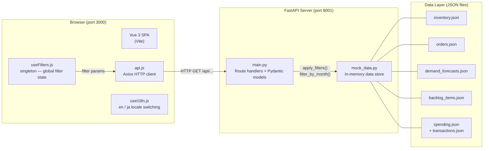
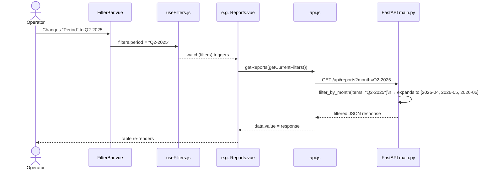
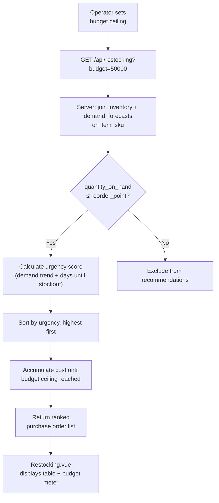

# Technical Approach

**RFP #:** MC-2026-0417  
**Prepared for:** Meridian Components, Inc.  
**Section:** §4.2 — Technical Approach

---

## What We Found

We reviewed the previous vendor's handoff notes and conducted our own inspection of the source code. The notes are thin — they describe the stack accurately but understate the issues. Here is what the code actually shows:

- **Reports.vue** is the only view that was not migrated to Vue 3 Composition API. It still uses the older Options API (`data()`, `methods()`, `mounted()`), which means it doesn't participate in the shared filter system the same way every other view does. This is the root cause of the filter wiring issues.
- **Internationalization** is implemented and working for most views, but `Reports.vue` and `Backlog.vue` contain hardcoded English strings that were never connected to the translation system.
- **No automated tests were delivered.** The previous vendor acknowledged this at handoff. Every change to this system since then has been approved on faith.
- **The data layer is entirely file-based** — JSON files loaded into memory at server startup. There is no database. This is fine for current scale but worth knowing when scoping changes.

The stack itself is sound: Vue 3 with Vite on the frontend, FastAPI on the backend, communicating over a clean REST API with a well-designed filter system. The bones are good. The incomplete work is localized.

---

## Current Architecture

The filter system is the architectural backbone. A singleton composable (`useFilters.js`) holds four global filters — Period, Warehouse, Category, and Order Status. Every view watches this state and re-fetches when it changes.

---

## Filter Propagation — Data Flow

The Reports module is broken because `Reports.vue` (Options API) does not set up the `watch` correctly — the filter change fires but the view doesn't re-fetch. This is the primary defect we'll fix in Phase 2.

---

## R1 — Reports Module Remediation

**What we'll do:**

1. **Defect audit sprint** (3 days): Catalog every issue in Reports — filter wiring, i18n gaps, console errors, API call patterns. Meridian's issue tracker (shared on award) supplements our own findings.
2. **Migrate to Composition API**: Rewrite `Reports.vue` using `<script setup>` and `useFilters.js`, matching the pattern of every other view in the application. This fixes filter reactivity structurally, not with patches.
3. **Wire all filters**: Connect the Period, Warehouse, Category, and Status filters to the reports API endpoints (`/api/reports/quarterly`, `/api/reports/monthly-trends`).
4. **i18n**: Route all hardcoded strings through the existing `useI18n.js` translation system. Add Japanese translations to `client/src/locales/ja.js`.
5. **Console noise**: Identify and resolve any unhandled promise rejections or Vue warnings.

**Assumption:** Meridian's defect tracker will be shared within 3 business days of contract award.

---

## R2 — Restocking Recommendations

**What we'll build:**

A new **Restocking** view that cross-references current stock levels against demand forecasts and surfaces ranked purchase order recommendations within an operator-supplied budget ceiling.

**New backend endpoint:** `GET /api/restocking?budget={ceiling}`  
**New frontend view:** `client/src/views/Restocking.vue`  
**Logic:** Items are ranked by an urgency score derived from `(forecasted_demand - quantity_on_hand)` weighted by demand trend (increasing = higher priority). The view shows a ranked table with a running budget total and a clear "recommended order" summary.

**Assumption:** Budget ceiling is operator-supplied per session; no persistence required. Purchase order records can be created via the existing `POST /api/purchase-orders` endpoint already in the backend.

---

## R3 — Automated Browser Testing

**Tool:** Playwright — already configured as an MCP server in this repository's `.mcp.json`.

**Coverage — critical flows:**

| Test | What it verifies |
|------|-----------------|
| Dashboard loads | KPI cards render, no console errors |
| Filter changes propagate | Changing Warehouse filter updates all visible data |
| Reports page renders | Quarterly table + monthly chart visible |
| Reports filters work | Period filter triggers data re-fetch |
| Restocking view | Budget input → recommendation table updates |
| Language switcher | Toggling EN→JA translates visible labels |

Tests run against `localhost:3000` and are written to `tests/` in the repository root. They serve as a regression gate — Meridian IT can run them before approving any future change.

---

## R4 — Architecture Documentation

We will deliver a current-state architecture overview as a self-contained HTML file (`proposal/architecture.html`) — readable in any browser, no tooling required. It will cover:

- Component hierarchy (Vue views, composables, shared components)
- Full API surface (all endpoints, parameters, response shapes)
- Data layer (JSON file schemas, relationships between entities)
- Filter system design
- i18n layer

This is the document the previous vendor should have left. We will write it after the code work is complete, so it reflects the actual delivered state rather than what was planned.

---

## D1 — UI Modernization (Desired)

We want to be direct: adopting a modern component library (e.g. shadcn/vue, PrimeVue) is a meaningful rebuild, not a polish pass. The current UI uses custom SVG charts and CSS Grid layouts — replacing those is not a small change. We have scoped this as a separate line item so Meridian can make an informed choice. If selected, we would prototype on a feature branch and review with Meridian before full delivery.

---

## D2 — Internationalization Extension (Desired)

The i18n infrastructure is already in place (`useI18n.js`, `/locales/en.js`, `/locales/ja.js`). The gap is that `Reports.vue` and `Backlog.vue` contain hardcoded English strings not routed through the translation system. This work is straightforward — we would extend both locale files and wire the remaining strings during the R1 remediation sprint, since we're already in those files.

---

## D3 — Dark Mode (Desired)

The application uses a slate/gray design token system. Dark mode is achievable via CSS custom properties — a `prefers-color-scheme` media query or a user-toggled `data-theme` attribute on the root element. We would prototype on an isolated branch, review with warehouse floor staff if Meridian can arrange it, and merge only once approved. Low implementation risk; good impact for low-light environments.

---

*Questions about this section? Contact us before May 8 per RFP §6.*
