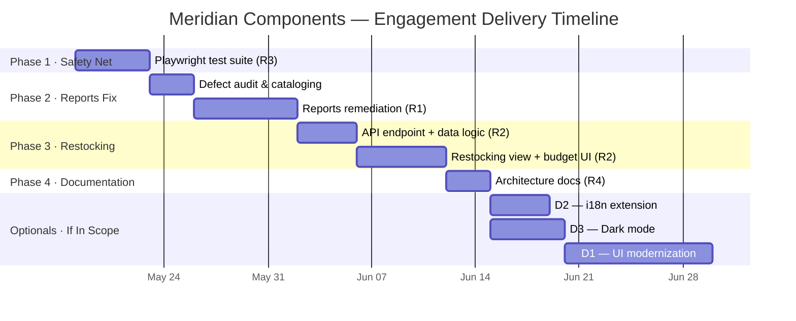

# Delivery Timeline

**RFP #:** MC-2026-0417  
**Prepared for:** Meridian Components, Inc.  
**Section:** §4.4 — Timeline

---

## Phasing Rationale

We have sequenced delivery to match Meridian's stated priorities while managing risk. The first thing we do is establish automated test coverage — not because it's the most visible deliverable, but because it makes every subsequent change safer to approve. After that, we work through the required items in priority order.

---

## Phase Details

### Phase 1 — Safety Net (Week 1)
**Deliverable:** Automated browser test suite (R3)  
**Duration:** 5 days  
**What happens:** We establish Playwright test coverage for the critical user flows listed in the technical approach — dashboard, filters, Reports, and language switching. These tests run against the live application and become the regression gate for all subsequent phases. Meridian IT receives the test suite and instructions for running it locally at the end of this phase.

**Milestone:** Test suite passing on Meridian's environment. ✓

---

### Phase 2 — Reports Remediation (Weeks 2–3)
**Deliverable:** Fixed Reports module (R1)  
**Duration:** 10 days (3 audit + 7 remediation)  
**What happens:** We spend the first three days cataloging every defect — our own findings plus Meridian's issue tracker (shared on award). We produce a written defect list for Meridian's review before we touch any code. Remediation follows: Composition API migration, filter wiring, i18n, console noise. Each fix is covered by the test suite from Phase 1.

**Milestone:** All cataloged defects resolved; Reports page passes automated tests. ✓

---

### Phase 3 — Restocking View (Weeks 3–5)
**Deliverable:** Restocking recommendations capability (R2)  
**Duration:** 10 days  
**What happens:** Backend first — new `/api/restocking` endpoint with urgency scoring and budget ceiling logic. Then the frontend view: ranked purchase order recommendations table with a budget meter. We review the UX with Meridian's operations team at the midpoint before finalizing the interface.

**Milestone:** Restocking view live; operators can enter a budget ceiling and receive ranked recommendations. ✓

---

### Phase 4 — Architecture Documentation (Week 6)
**Deliverable:** Current-state architecture overview (R4)  
**Duration:** 3 days  
**What happens:** Written after all code work is complete, so it documents what was actually delivered. Self-contained HTML file, no tooling required to read it.

**Milestone:** Architecture doc delivered to Meridian IT. ✓

---

### Optionals — If In Scope (Weeks 6–10)
Run after required scope is complete and approved. D2 and D3 can proceed in parallel; D1 follows after D3 (shares CSS work).

| Item | Duration | Notes |
|------|----------|-------|
| D2 — i18n extension | 4 days | Much of this overlaps with R1 work already done in Reports |
| D3 — Dark mode | 5 days | Prototyped on isolated branch, reviewed before merge |
| D1 — UI modernization | 10 days | Scoped as a separate mini-engagement; requires design review checkpoint |

---

## Key Dates (Assuming May 18 Kickoff)

| Event | Date |
|-------|------|
| Contract award / kickoff | May 18, 2026 |
| Defect tracker shared by Meridian | May 25, 2026 (by) |
| Phase 1 complete | May 22, 2026 |
| Phase 2 complete | June 4, 2026 |
| Phase 3 complete | June 18, 2026 |
| Phase 4 complete (required scope done) | June 23, 2026 |
| Optionals complete (if all in scope) | July 10, 2026 |

---

*Timeline assumes remote engagement and Meridian IT environment access within 2 business days of kickoff.*
